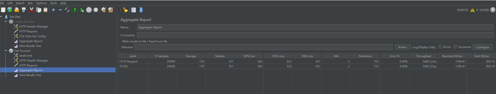

# Tuum Account API

Assignment project for Tuum interview

#### Swagger end point : http://localhost:8080/swagger-ui/index.html#/

## Running application

1. Build gradle project

Command will create the jar that will be used in docker container

`gradle clean build`

2. Boot up docker containers

run `docker-compose up` command and once the PostgreSQL and RabbitMQ containers have successfully started, the main application will be run.

Application will be reachable on port 8080

Rabbit will be reachable at http://localhost:15672/ , rabbit username and password is guest 

Port 5005 can be used for remote debugging

ps: if you want to run application from your IDE then you need to change postgres and rabbit config from your application.yml

### Performance Test Results

JMeter is used to load endpoints and determine the throughput. 
Enhancing API throughput can be achieved by redesigning APIs into nonblocking structures, with such technologies: Spring WebFlux, Java CompletableFuture, and DeferredResult.

### Before Rabbit Integration

#### Account Creation Api

Three unique currency balances are created in db for each account. Changes in the size of the currency list can impact the API's performance.

Config: 2000 threads / 10 loop count

Result: ~1500 RPS

#### Get Account Api

Get Account API is invoked for random accounts using a randomly generated number within the range of 1 to 1000.

Config: 2000 threads / 10 loop count

Result: ~5500 RPS

### After Rabbit Integration

Publishing messages to the RabbitMQ queue led to a slight reduction in service performance.

#### Account Creation Api

Config: 2000 threads / 10 loop count

Result: ~1200 RPS

